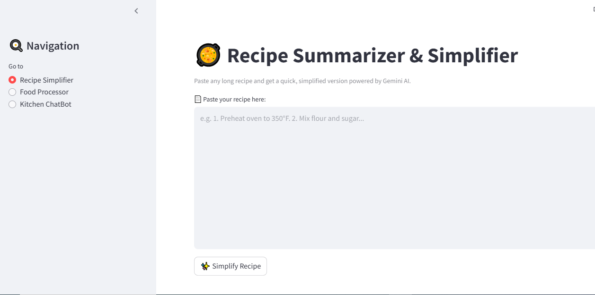

# -AI-CHEF-MASTER
# 🍽️ Smart Food & AI Assistant (Multi-Feature App)

This project combines multiple AI-powered features to simplify food-related interactions, complaint handling, and recipe management using **Streamlit** and **Gemini API**.

---

## 🔹 Features

### 🗣 Conversational AI (Hindi + English)
- Chat with the system in Hindi or English.
- Supports multi-turn conversations with dynamic and intelligent responses.

### 🎙️ Voice Interaction
- Interact by speaking in Hindi or English.
- Integrated speech-to-text and text-to-speech for natural communication.

### 🖼️ Image & Document Analysis
- Upload food-related images such as ingredient lists or bills.
- Automatically detects and describes key objects like ingredients, food items, or receipts.
- Uses OCR to extract text from printed or handwritten documents.

### 📌 Automated Complaint Mapping
- Automatically categorizes and maps complaints to the correct food departments.
- Tailored complaint classification for different types of users (e.g., consumers, admins).

### 🥘 Recipe Summarizer
- Paste a detailed recipe and receive a simplified, step-by-step version.
- Helps users quickly understand and follow long cooking instructions.

---

## 🛠️ Built With
- [Streamlit](https://streamlit.io/) – For building the user interface
- [Google Gemini API](https://ai.google.dev/) – For powering AI functionalities
- [SpeechRecognition, gTTS, PyTTSx3, OpenCV, Tesseract OCR, PIL] – For voice, image, and document processing

---

 
